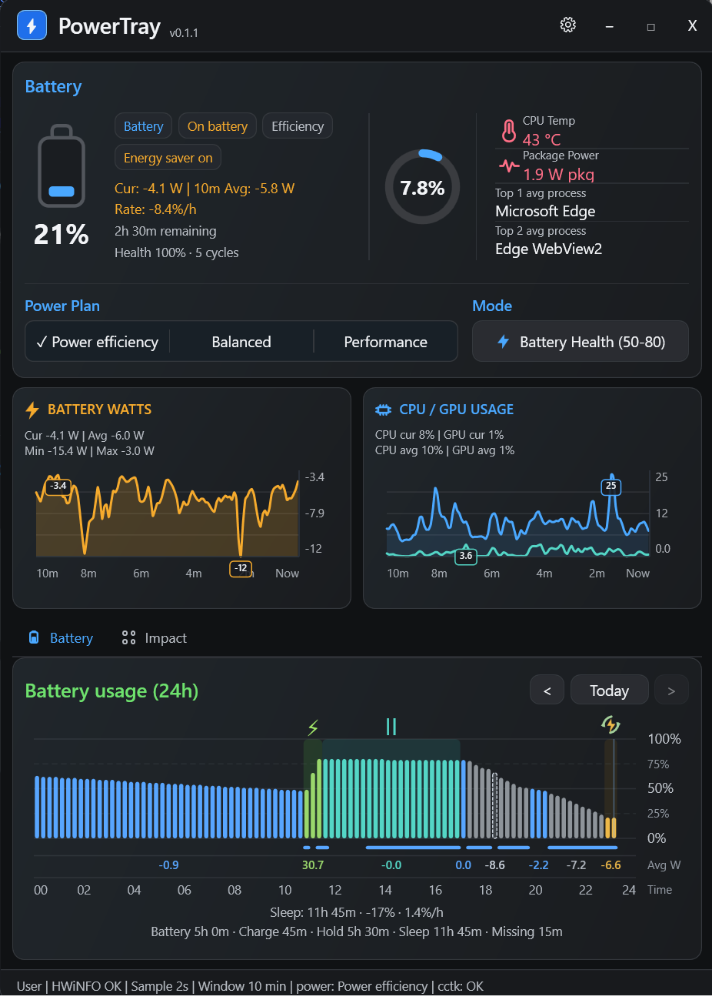
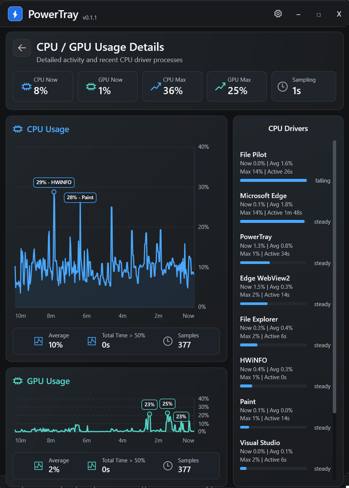
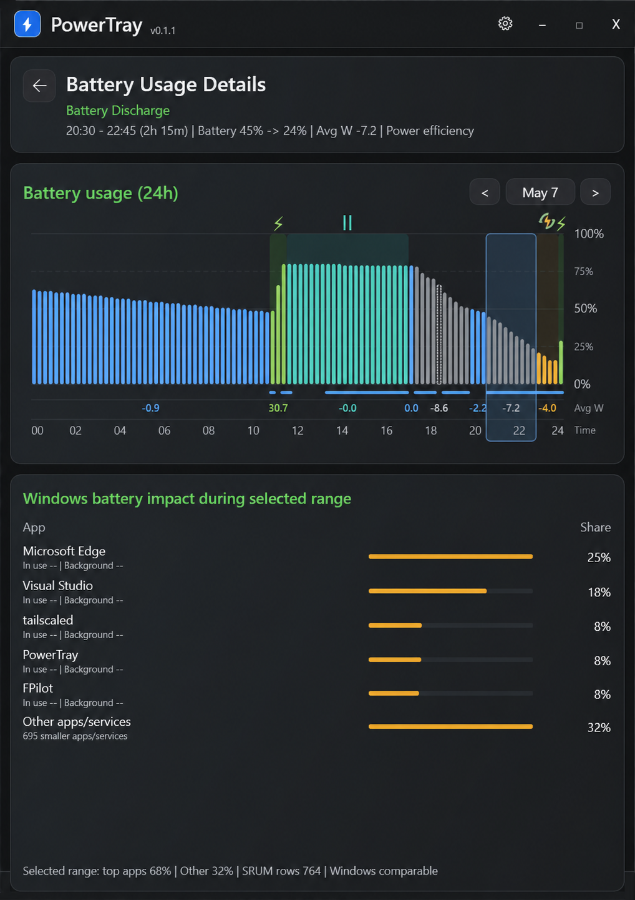

# PowerTray

Lightweight Windows tray utility for laptop power, battery, thermal, and process monitoring. It can switch Dell BIOS battery charge settings through Dell Command | Configure `cctk.exe` when Dell hardware/tools are available, and it shows a compact live dashboard for battery, CPU, processes, power modes, and optional HWiNFO sensors.



## Requirements

- Windows 11 x64
- .NET 8 Desktop Runtime or .NET 8 SDK
- Dell Command | Configure Application is required for Dell BIOS battery charge setting changes. Download it from Dell: [Dell Command | Configure Application](https://www.dell.com/support/home/en-us/drivers/DriversDetails?driverId=F2V9N).
- Optional: HWiNFO with Shared Memory Support enabled for the most reliable advanced sensors
- Optional: built-in LibreHardwareMonitor sensor provider for advanced sensors without running HWiNFO

Default `cctk.exe` paths checked automatically:

- `C:\Program Files (x86)\Dell\Command Configure\X86_64\cctk.exe`
- `C:\Program Files\Dell\Command Configure\X86_64\cctk.exe`

If neither path exists, open Settings and browse to `cctk.exe`.

## Build

From the repo root:

```powershell
dotnet build .\PowerTray.slnx -c Release
```

To publish a standalone x64 folder:

```powershell
dotnet publish .\PowerTray\PowerTray.csproj -c Release -r win-x64 --self-contained false
```

This development machine has a preview .NET 10 SDK that currently fails during apphost `.exe` generation with a Windows file-locking error in the synced Google Drive folder. The project sets `UseAppHost=false` so Visual Studio and CLI builds produce `PowerTray.dll` without creating `PowerTray.exe`.

Run from the build folder with:

```powershell
dotnet PowerTray.dll
```

For a normal `.exe` publish, use the stable .NET 8 SDK outside a synced-drive build folder and temporarily remove or override `UseAppHost=false`.

## Admin Behavior

The app does not require administrator rights for the dashboard, settings, or reading current status. Dell BIOS battery mode changes require elevation.

When you manually select a battery preset, the app checks whether it is already elevated. If it is not, it launches only the needed helper command through UAC, captures the elevated `cctk.exe` result through a temp JSON handoff, and shows the command result in the dashboard status area.

The app does not repeatedly write BIOS settings. It writes only when you manually choose a mode.

## Battery Presets

- Battery Health: `Custom:50-80`
- Balanced: `Custom:70-90`
- Charge to Full: `Standard`
- Primarily AC Use: `PrimAcUse`
- Adaptive: `Adaptive`

The custom ranges can be changed in Settings.

## Dashboard Layout

The dashboard is a compact fixed-size dark window designed to show the key tray-utility information without scrolling:

- Header with app title, Modes flyout, Settings, and window controls
- Status chips for AC/battery state, power mode, Energy saver state, and current Dell charge mode
- Battery and CPU summary cards with friendly labels instead of raw `cctk.exe` output
- Rolling 10-minute chart cards for battery watts and CPU / GPU usage
- Current / average / minimum / maximum stats in each chart header
- Battery usage history with power-plan, charge, charge-hold, sleep, missing-data, and Energy saver indicators
- Windows battery impact data when the helper service or administrator access is available

Memory, fan, and raw sensor details are intentionally kept out of the main dashboard so the tray popup stays dense and readable.

## CPU / GPU Details

Click the CPU / GPU usage card to open the detailed usage view. It expands the CPU graph, keeps GPU usage visible, and replaces the older top-peaks list with a smoothed CPU driver/process list. This helps answer "what has been driving CPU recently?" without relying on the constantly jumping process order in Task Manager.



## Battery Usage Details

Click a battery usage block to open the detailed battery usage view. The selected range stays highlighted, and the lower panel shows Windows battery impact data for that time range when elevated access or the helper service is available. The graph also shows charge, charge-hold, sleep, missing-data, power plan, average watts, and Energy saver periods.



## Advanced Sensors

The dashboard tries advanced sensors in this order:

1. HWiNFO shared memory, if enabled and available
2. Built-in LibreHardwareMonitor provider, if enabled
3. Windows fallback stats

HWiNFO remains the most reliable source. Enable HWiNFO Shared Memory Support and keep the HWiNFO sensors window active when you want its exact sensor table.

LibreHardwareMonitor runs inside this app, so you do not need a separate HWiNFO background process. It can expose CPU temperature, CPU package power, fan RPM, and sometimes battery charge/discharge watts depending on hardware and permissions. On some systems it may require administrator rights or may not expose every Dell sensor. If only some sensors are available, the dashboard shows `LHM partial` and logs the visible sensor list for troubleshooting.

If HWiNFO shared memory is unavailable, the app keeps running with Windows fallback stats:

- Battery percentage and AC status
- Estimated battery time if Windows exposes it
- CPU usage estimated from process CPU deltas
- Memory totals
- Top CPU and memory processes

The app does not fake missing temperature, fan, package-power, or watt values. Unavailable chart panels show unavailable stats until HWiNFO, LibreHardwareMonitor, or Windows exposes the relevant sensor.

## Settings And Data

Settings:

```text
%AppData%\PowerTray\settings.json
```

Logs:

```text
%AppData%\PowerTray\logs\app.log
```

No telemetry, analytics, or network calls are used.

## Known Limitations

- HWiNFO and LibreHardwareMonitor sensor names vary by machine; matching is flexible but should be validated on each target laptop.
- Per-process battery drain is not available from Windows as exact watts. The “Estimated Energy Impact” view is an estimate based on accumulated CPU activity and battery discharge rate when available.
- The energy history is persisted to `%AppData%\PowerTray\energy-history.json` and resets when a new discharging session begins.
- Windows usually does not expose fan RPM or CPU package temperature without vendor/third-party sensors.
- The installer registers the PowerTray battery-impact helper service so Windows battery impact can be read without running the tray UI as Administrator.

## Support / Donations

PowerTray is a personal project shared for free. If it saves you time and you want to support continued development, donations are welcome but completely optional.

Donation link: ko-fi.com/andreys

Testing on other Dell laptops, opening issues, sharing feedback, and suggesting useful features also helps a lot.
